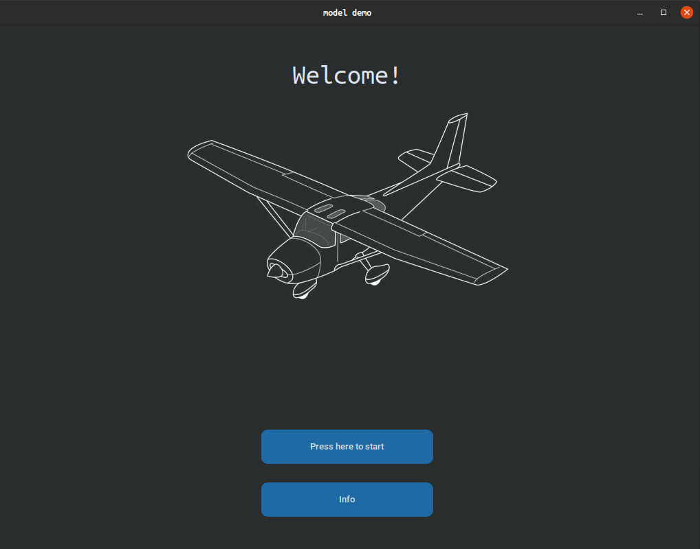
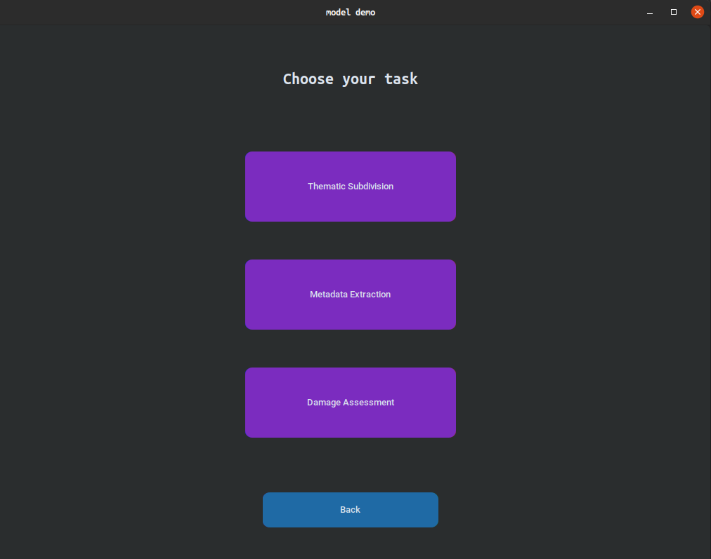

# App

### Basic GUI for thematic subdivision, metadata extraction, and damage assessment using tkinter.
###

###
For all the processes, select the input folder that contains all the images
1. In the thematic subdivision processes, a new folder "thematic_subdivision_result",  inside the folder of the input images will be created. 
It will contain the folders of classified images.

    N.B classified images are a copy of the unlabeled images.

2. In the metadata extraction, a csv file "metadata_results.csv" will be created in the provided folder. It will contain the image paths, their subject, content,
description, and damage level.

3. In the damage assessment process, a new folder "damage_assessment_result",  inside the folder of the input images will be created. 
It will contain the folders of classified images.

    N.B classified images are a copy of the unlabeled images.

##

###

To install the requirements run
      
      pip install -r requirements.txt

To install OFA transformer model and download the checkpoint refer to
      
      https://huggingface.co/OFA-Sys/ofa-large

The other checkpoints are available here

      https://drive.google.com/drive/folders/1gtqUgeDxxEeMTkBRgL-2rIbkJRL11VAW?usp=sharing
      

To make an Ubuntu application
   * edit the folder path in demo_app.desktop
   * create a new folder inside /path_to_folder/ called "checkpoints"
   * extract the checkpoints inside /path_to_folder/checkpoints
   * add OFA-large folder inside /path_to_folder/checkpoints and rename it as "caption_checkpoint"

   * run in the terminal
        
            chmod u+x /path_to_folder/demo_app.desktop
        
            sudo cp /path_to_folder/demo_app.desktop /usr/share/applications/demo_app.desktop
      
   * Now you can find this application among the others
###

### References
1.  Dosovitskiy, A., Beyer, L., Kolesnikov, A., Weissenborn, D., Zhai, X., Unterthiner, T., Dehghani, M., Minderer, M., Heigold, G., Gelly, S., Uszkoreit, J., Houlsby, N. (2020). An Image is Worth 16x16 Words: Transformers for Image Recognition at Scale. arXiv. https://arxiv.org/abs/2010.11929
2. Liu Z.,  Lin Y., Cao Y., Hu H., Wei Y., Zhang Z., Lin S., Guo B. (2021). Swin Transformer: Hierarchical Vision Transformer using Shifted Windows. arXiv. https://arxiv.org/abs/2103.14030.
3. Wang, P., Yang, A., Men, R., Lin, J., Bai, S, Li, Z., Ma, J., Zhou, C., Zhou, J., Yang, Hongxia (2022). Unifying Architectures, Tasks, and Modalities Through a Simple Sequence-to-Sequence Learning Framework.