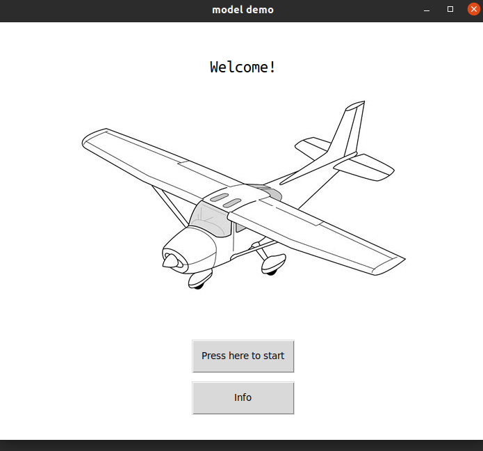

# Demo

### Basic GUI for thematic subdivision and metadata extraction using ViT pre-trained model, and tkinter
###

For both tasks provide the path for the images.

###
At the end of thematic subdivision processes, a new folder "classification_result" inside the folder of the input images will be created. 
It will contain the folders of classified images.

N.B classified images are a copy of the unlabeled images.

At the end of metadata extraction, a csv file "metadata_results.csv" will be created in the provided folder. It will contain the image paths, their subject, the content, and the caption.
##

